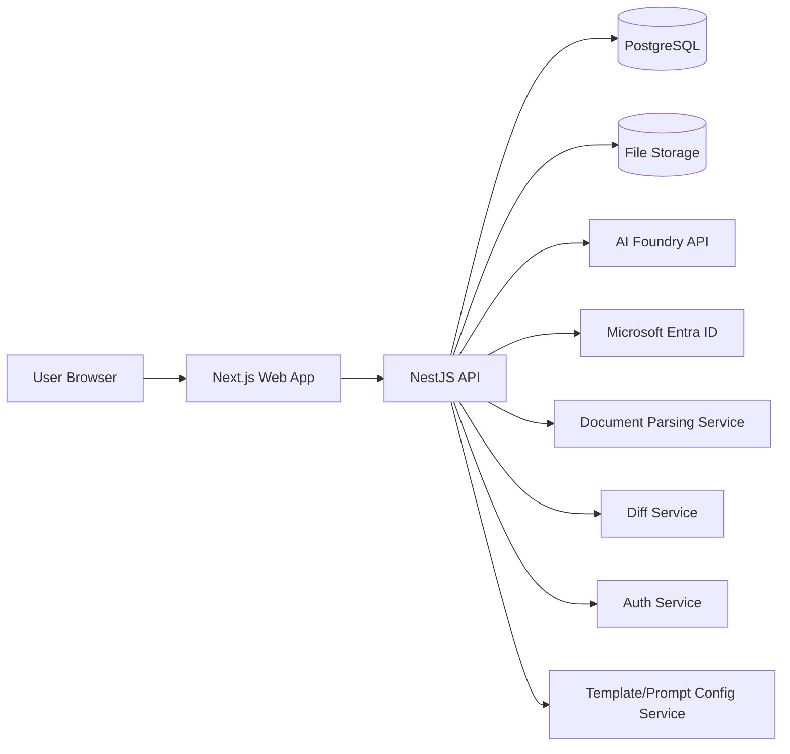
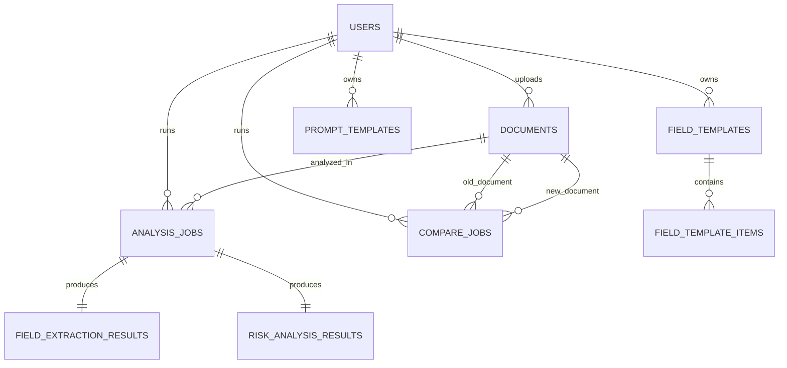
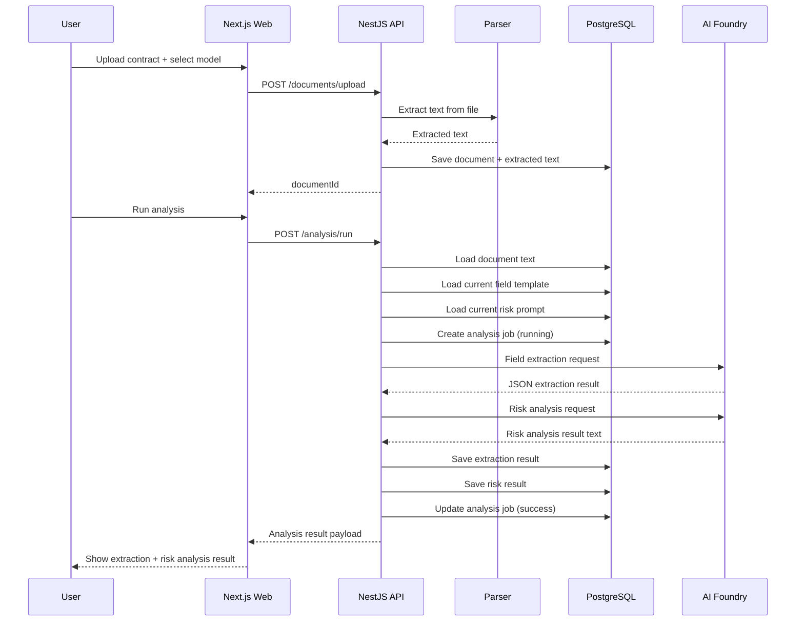
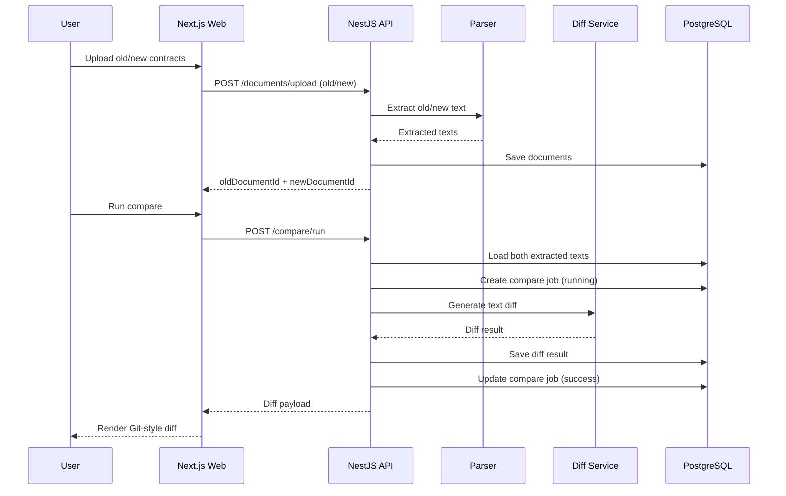
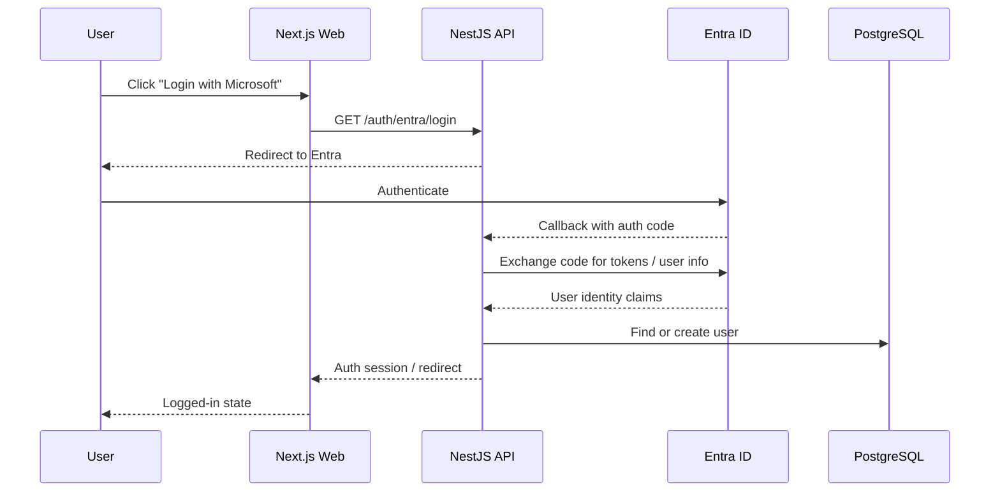

# 技术设计文档

# Contract AI Review App - Technical Design Document

- Version: v1.0
- Status: Draft
- Owner: Engineering
- Last Updated: 2026-05-09

---

## 1. Overview

This document defines the system architecture, module design, data model, integration strategy, and implementation details for the Contract AI Review App.

The application provides:
1. Contract upload, text extraction, AI-based field extraction, and AI-based risk analysis
2. Two-version contract comparison with Git-style diff visualization
3. Local authentication and Microsoft Entra ID SSO
4. User and admin configuration for field templates and risk prompt templates
5. Backend-configured AI Foundry model selection

---

## 2. Technology Stack

### 2.1 Monorepo
- pnpm workspace
- Turborepo

### 2.2 Frontend
- Next.js
- React
- Ant Design
- TanStack Query
- Zustand or Context for lightweight client state
- Diff viewer library:
  - react-diff-viewer-continued
  - or diff2html (optional)

### 2.3 Backend
- NestJS
- Prisma ORM
- PostgreSQL

### 2.4 Authentication
- Local authentication with JWT / refresh token
- Microsoft Entra ID via OIDC / OAuth2

### 2.5 Document Parsing
- PDF: pdf-parse or pdfjs-based parser
- DOCX: mammoth
- TXT: native text load
- DOC: limited support or conversion strategy
- OCR: out of scope for MVP

### 2.6 AI Integration
- AI Foundry API
- Model list configured by environment variables

### 2.7 Storage
- Metadata: PostgreSQL
- Files:
  - MVP: local filesystem or mounted volume
  - Future: Azure Blob Storage

---

## 3. High-Level Architecture



### 3.1 Responsibilities
- **Next.js Web App**: UI rendering, user interaction, authenticated API calls
- **NestJS API**: business logic, auth, file handling, text extraction, AI orchestration, persistence
- **PostgreSQL**: structured data and history
- **File Storage**: uploaded original files
- **AI Foundry API**: field extraction and risk analysis
- **Entra ID**: SSO authentication provider

---

## 4. Monorepo Structure

```text
repo/
  apps/
    web/                       # Next.js frontend
    api/                       # NestJS backend
  packages/
    shared-types/              # shared DTO/types/interfaces
    eslint-config/
    tsconfig/
    ui/                        # optional shared UI package
  docs/
    PRD.md
    TECH_SPEC.md
```

### 4.1 Rationale
- Shared types between frontend and backend
- Unified linting and TS config
- Easier CI/CD and dependency management
- Better maintainability for a full-stack TypeScript system

---

## 5. Functional Architecture

### 5.1 Backend Modules

1. **AuthModule**
   - local login/logout/change password
   - token management

2. **SsoModule**
   - Entra login redirect
   - callback handling
   - account linking

3. **UsersModule**
   - current user info
   - admin user management

4. **ModelsModule**
   - return supported AI models from env config

5. **DocumentsModule**
   - upload file
   - extract text
   - manage file metadata

6. **FieldTemplatesModule**
   - get/save/reset field templates
   - admin system defaults

7. **PromptTemplatesModule**
   - get/save/reset prompt templates
   - admin system defaults

8. **AnalysisModule**
   - orchestrate field extraction
   - orchestrate risk analysis
   - save results
   - return history and details

9. **CompareModule**
   - upload and compare two contracts
   - compute diff
   - save comparison results

10. **HistoryModule**
   - list recent history
   - view historical detail

### 5.2 Frontend Pages
- `/login`
- `/analysis`
- `/compare`
- `/history`
- `/settings`
- `/profile`

---

## 6. Authentication and Authorization Design

### 6.1 Roles
- `admin`
- `user`

### 6.2 Authentication Modes
- `local`
- `entra`

### 6.3 Access Rules
- All business data is scoped by `user_id`
- Users can access only their own:
  - documents
  - analysis jobs
  - compare jobs
  - personal templates
- Admin can manage system default templates and users
- Admin should not automatically access user contract content in MVP unless explicitly required

### 6.4 Token Strategy
Recommended:
- Access token: short-lived JWT
- Refresh token: httpOnly cookie or secure refresh strategy

---

## 7. Data Model

### 7.1 Entity Relationship Overview



### 7.2 Core Tables

#### users
- id
- email
- name
- password_hash nullable
- auth_provider (`local`, `entra`)
- entra_oid nullable
- role (`admin`, `user`)
- status (`active`, `disabled`)
- created_at
- updated_at

#### field_templates
- id
- user_id nullable
- name
- is_default
- is_system
- created_at
- updated_at

#### field_template_items
- id
- template_id
- field_name
- field_description
- sort_order
- created_at
- updated_at

#### prompt_templates
- id
- user_id nullable
- name
- template_type (`risk_analysis`)
- content
- is_default
- is_system
- created_at
- updated_at

#### documents
- id
- user_id
- file_name
- file_type
- file_size
- storage_path
- extracted_text
- text_extraction_status (`pending`, `success`, `failed`)
- created_at
- updated_at

#### analysis_jobs
- id
- user_id
- document_id
- model_name
- field_template_id nullable
- prompt_template_id nullable
- field_template_snapshot_json
- prompt_snapshot_text
- status (`pending`, `running`, `success`, `failed`)
- error_message nullable
- created_at
- updated_at

#### field_extraction_results
- id
- analysis_job_id
- result_json
- created_at

#### risk_analysis_results
- id
- analysis_job_id
- result_text
- created_at

#### compare_jobs
- id
- user_id
- old_document_id
- new_document_id
- diff_mode (`unified`, `side_by_side`)
- status (`pending`, `running`, `success`, `failed`)
- diff_result_json
- error_message nullable
- created_at
- updated_at

---

## 8. Configuration Strategy

### 8.1 Environment Variables
Example:

```env
NODE_ENV=production

DATABASE_URL=postgresql://...
JWT_SECRET=...
JWT_EXPIRES_IN=15m
REFRESH_TOKEN_SECRET=...
REFRESH_TOKEN_EXPIRES_IN=7d

AI_FOUNDRY_API_URL=https://...
AI_FOUNDRY_API_KEY=...
AI_FOUNDRY_MODELS=gpt-5.4,gpt-5.4-mini
AI_FOUNDRY_TIMEOUT_MS=120000

FILE_UPLOAD_DIR=./uploads
MAX_UPLOAD_SIZE_MB=20

ENTRA_CLIENT_ID=
ENTRA_CLIENT_SECRET=
ENTRA_TENANT_ID=
ENTRA_REDIRECT_URI=
```

### 8.2 Config Ownership
- Backend is source of truth for supported model list
- Frontend fetches models via API
- System default templates are stored in DB, not hardcoded in frontend

---

## 9. Prompting Strategy

### 9.1 Field Extraction Prompt Template
The backend dynamically injects:
- `{fields_json}`
- `{contract_text}`

Recommended template:

```text
You are a professional contract information extraction assistant.

Your task is to extract specific fields from the contract text strictly based on the content explicitly stated in the contract.

Do not fabricate, infer, guess, or supplement information that is not expressly written in the contract.
If a field cannot be found, return null for extracted_value and explain briefly in comments.

## Extraction Requirements
For each field below, return:
- field
- field_description
- extracted_value
- evidence
- confidence
- comments

## Output Rules
1. Output must be valid JSON only.
2. Use the exact field names provided.
3. "evidence" should quote or faithfully extract the relevant contract text.
4. "confidence" should be one of: high, medium, low.
5. If not found, set:
   - extracted_value: null
   - evidence: null
   - confidence: low
   - comments: "Not explicitly found in the contract."
6. Do not include any explanation outside JSON.

## Fields to Extract
{fields_json}

## Contract Text
{contract_text}
```

### 9.2 Risk Analysis Prompt Template
The provided prompt is stored as system default prompt template.
The backend injects:
- `{contract_text}`

### 9.3 Prompt Validation Rules
- Risk prompt must contain `{contract_text}`
- If field extraction prompt ever becomes editable, it must contain both `{fields_json}` and `{contract_text}`
- Prompt size should be validated to prevent abuse and unstable requests

### 9.4 Snapshot Requirement
At runtime, both prompt and field configuration must be snapshotted into the analysis job record.

---

## 10. Main Workflows

## 10.1 Contract Analysis Workflow



## 10.2 Contract Comparison Workflow



## 10.3 Entra SSO Workflow



---

## 11. API Design

### 11.1 Auth APIs

#### POST /auth/login
Request:
```json
{
  "email": "user@example.com",
  "password": "******"
}
```

Response:
```json
{
  "accessToken": "jwt",
  "user": {
    "id": "u1",
    "email": "user@example.com",
    "name": "User",
    "role": "user",
    "authProvider": "local"
  }
}
```

#### POST /auth/logout

#### POST /auth/change-password
Request:
```json
{
  "oldPassword": "old",
  "newPassword": "new"
}
```

#### GET /auth/me

#### GET /auth/entra/login

#### GET /auth/entra/callback

---

### 11.2 Models API

#### GET /models
Response:
```json
[
  { "name": "gpt-5.4", "label": "gpt-5.4" },
  { "name": "gpt-5.4-mini", "label": "gpt-5.4-mini" }
]
```

---

### 11.3 Field Template APIs

#### GET /field-templates/current
Returns current user's field template, or fallback to system default.

#### PUT /field-templates/current
Request:
```json
{
  "name": "My Fields",
  "items": [
    {
      "fieldName": "Contract Name",
      "fieldDescription": "Extract contract title",
      "sortOrder": 1
    }
  ]
}
```

#### POST /field-templates/current/reset

#### Admin APIs (optional in MVP)
- GET /admin/field-templates/default
- PUT /admin/field-templates/default

---

### 11.4 Prompt Template APIs

#### GET /prompt-templates/current?type=risk_analysis

#### PUT /prompt-templates/current?type=risk_analysis
Request:
```json
{
  "name": "My Risk Prompt",
  "content": ".... {contract_text}"
}
```

#### POST /prompt-templates/current/reset?type=risk_analysis

#### Admin APIs (optional in MVP)
- GET /admin/prompt-templates/default?type=risk_analysis
- PUT /admin/prompt-templates/default?type=risk_analysis

---

### 11.5 Document APIs

#### POST /documents/upload
Multipart form-data:
- file

Response:
```json
{
  "id": "doc_123",
  "fileName": "contract.pdf",
  "textExtractionStatus": "success"
}
```

#### GET /documents/:id

---

### 11.6 Analysis APIs

#### POST /analysis/run
Request:
```json
{
  "documentId": "doc_123",
  "model": "gpt-5.4"
}
```

Response:
```json
{
  "analysisJobId": "job_123",
  "status": "success",
  "fieldExtractionResult": [...],
  "riskAnalysisResult": "..."
}
```

#### GET /analysis/:id

#### GET /analysis/recent
Returns latest 10 records for current user.

---

### 11.7 Compare APIs

#### POST /compare/run
Request:
```json
{
  "oldDocumentId": "doc_old",
  "newDocumentId": "doc_new",
  "diffMode": "side_by_side"
}
```

#### GET /compare/:id

#### GET /compare/recent

---

## 12. Backend Processing Design

### 12.1 Document Upload and Extraction
1. Validate MIME type and file size
2. Store original file to storage path
3. Detect file type
4. Use parser based on type
5. Save extracted text into `documents.extracted_text`
6. Set extraction status

### 12.2 Field Extraction Processing
1. Load extracted contract text
2. Load current field template
3. Serialize fields into JSON string
4. Build prompt from template
5. Call AI Foundry
6. Parse AI result as JSON
7. Save result
8. Associate with analysis job

### 12.3 Risk Analysis Processing
1. Load current risk prompt
2. Replace `{contract_text}`
3. Call AI Foundry
4. Save response text

### 12.4 Comparison Processing
1. Load old and new extracted text
2. Normalize line endings / whitespace if needed
3. Generate text diff
4. Save diff payload

---

## 13. Diff Strategy

### 13.1 Recommended MVP Approach
Use deterministic text diff rather than AI for comparison.

### 13.2 Why
- Fast
- Reproducible
- Easier Git-style visualization
- Lower cost
- More suitable for clause-level textual changes

### 13.3 Output Form
`diff_result_json` may store structured chunks, for example:
- added lines
- removed lines
- unchanged blocks
- line indexes

---

## 14. Frontend Design

## 14.1 App Layout
- Left sidebar navigation
- Main content area
- Header with current user info and logout

## 14.2 Key Views

### Contract Analysis Page
Sections:
- upload card
- model selector
- fields config tab
- prompt config tab
- run button
- extraction result panel
- risk analysis result panel
- recent history panel

### Contract Compare Page
Sections:
- old contract upload
- new contract upload
- diff mode selector
- compare button
- diff viewer

### History Page
Sections:
- analysis records
- compare records
- detail drawer/page

### Settings Page
Sections:
- personal field template
- personal risk prompt
- admin system defaults if role=admin

### Profile Page
Sections:
- user info
- auth provider
- password change (local only)

---

## 15. Error Handling Strategy

### 15.1 Upload Errors
- unsupported file type
- file too large
- storage failure

### 15.2 Extraction Errors
- parser unsupported
- parsing exception
- empty extracted text

### 15.3 AI Errors
- timeout
- invalid model
- malformed response
- quota/credential issues

### 15.4 Validation Errors
- missing `{contract_text}` in prompt
- empty field list
- missing uploaded document

### 15.5 User Experience
Errors should be returned with:
- clear message
- actionable guidance where possible
- retry option for safe operations

---

## 16. Security Considerations

### 16.1 Authentication Security
- bcrypt/argon2 for password hashing
- secure JWT secret handling
- refresh token rotation recommended

### 16.2 Authorization Security
- all data access scoped by authenticated user id
- admin routes protected by role guard

### 16.3 Upload Security
- validate file extension and MIME
- limit file size
- sanitize file names
- store outside public web root

### 16.4 Prompt and AI Security
- limit prompt size
- avoid leaking sensitive internal system config in prompts
- log metadata rather than sensitive full prompt content where possible in infrastructure logs

### 16.5 Sensitive Data Handling
Contract content may be sensitive. Ensure:
- restricted access
- encrypted transport (HTTPS)
- minimal log exposure

---

## 17. Observability and Operations

### 17.1 Logging
Recommended logs:
- auth events
- upload start/failure/success
- extraction failure
- AI request start/failure/success
- compare job start/failure/success

### 17.2 Metrics
Recommended metrics:
- upload success rate
- extraction success rate
- AI latency
- analysis success rate
- compare latency
- average contract size

### 17.3 Monitoring
- application errors
- DB connection health
- AI API availability
- storage availability

---

## 18. Deployment Considerations

### 18.1 Runtime
- Frontend: Node.js runtime for Next.js
- Backend: Node.js runtime for NestJS
- DB: PostgreSQL managed service or containerized instance

### 18.2 Environments
- local
- dev
- test
- staging
- production

### 18.3 CI/CD
Suggested pipeline:
1. install dependencies
2. lint
3. test
4. build web
5. build api
6. run migrations
7. deploy

---

## 19. Open Technical Questions

1. Should file storage be local disk in production or Azure Blob from day one?
2. Should history retention be soft unlimited or hard limited to latest 10?
3. Should OCR be scheduled in phase 2?
4. Do we need background job queue from MVP if AI latency is high?
5. Should DOC file support be implemented or converted externally?
6. Should admin be able to impersonate/support users?

---

## 20. Recommended MVP Decisions

1. Use local disk or mounted volume for uploaded files in MVP
2. Store all historical records in DB, show latest 10 in UI
3. Do not implement OCR in MVP
4. Run analysis synchronously in MVP if expected latency is acceptable
5. Support PDF, DOCX, TXT first; DOC as best-effort only
6. Use Admin/User roles only
7. Use deterministic text diff for compare

---

## 21. Implementation Roadmap

### Phase 1
- project scaffolding
- auth
- Entra SSO
- upload and text extraction
- field template management
- prompt template management
- AI model API
- contract analysis flow
- compare flow
- history
- basic admin defaults

### Phase 2
- OCR
- async job queue
- AI-generated compare summary
- exports
- search/filter
- audit logs

---

## 22. Appendix

### 22.1 CSV Initialization Note
The provided `CTS_fields.csv` appears to contain text encoding issues. Before initializing system default fields:
1. recover original encoding
2. convert to UTF-8
3. verify field names and descriptions
4. import into `field_templates` and `field_template_items`

### 22.2 Suggested Libraries
Frontend:
- antd
- @tanstack/react-query
- react-diff-viewer-continued

Backend:
- @nestjs/passport
- passport-azure-ad or msal/oidc strategy
- prisma
- multer
- pdf-parse
- mammoth
- diff
- bcrypt or argon2
